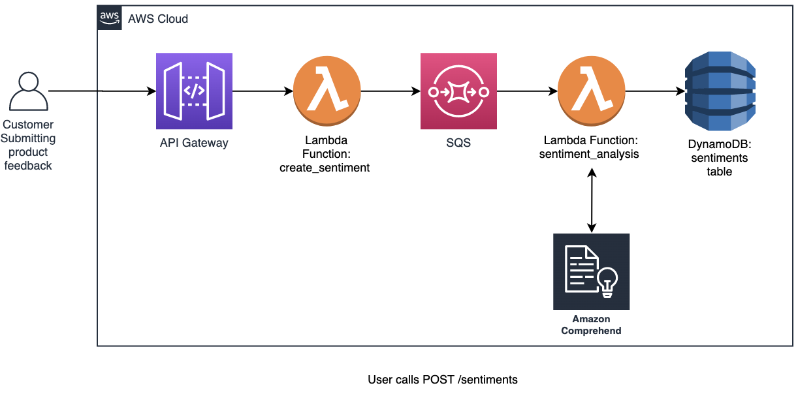
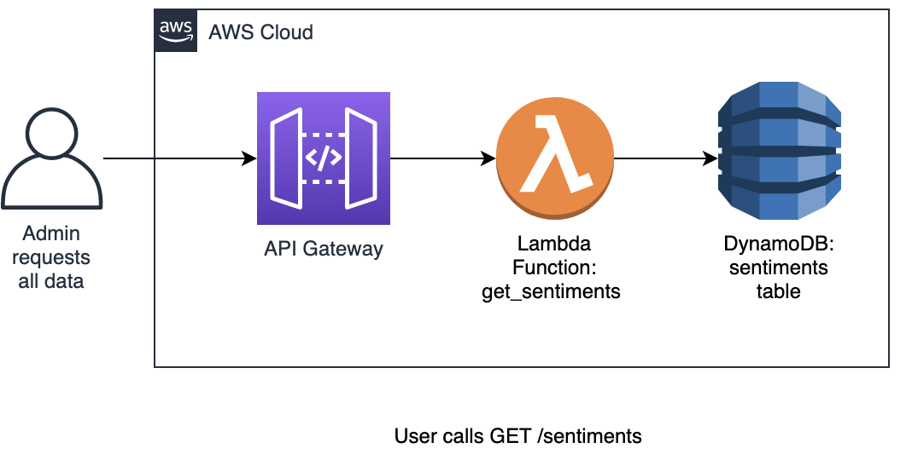

# Sample Sentiment Analyzer
**Note: This is not Production grade and simply meant as a demo**

## Description

This project will build a serverless sentiment analyzer leveraging Amazon Comprehend's natural language processing (NLP) capabilities. 
The user needs to post a review to an endpoint (POST /sentiments), this endpoint pushes the data to a queue.
Data in the queue is processed by a lambda function, this function calls Amazon Comprehend to analyze the sentiment. Once the analysis is completed, results are save in an Amazon DynamoDB Table. 

 


Sentiments can later be retrieved by calling GET /sentiments.

 


## AWS Services

* AWS Lambda
* Amazon Comprehend
* Amazon DynamoDB
* Amazon SQS
* Amazon API Gateway

## Pre-Requisites

* SAM CLI - <https://docs.aws.amazon.com/serverless-application-model/index.html>

## Instructions

1. Update deploy.sh

  ```bash
  S3_BUCKET='my-playpen' # This bucket needs to exist in your AWS account
  ```

2. Run deploy.sh

  ```bash
  $ ./deploy.sh
  ```

Take note of the output of this command as you will need the URLs mentioned there. See example bellow

```
Key                 CreateSentimentFunction                                                                                                            
Description         API Gateway endpoint URL for Prod stage for Create Sentiment                                                                       
Value               POST https://sev3nndf0g.execute-api.ca-central-1.amazonaws.com/Prod/sentiments/                                                    

Key                 GetSentimentsFunction                                                                                                              
Description         API Gateway endpoint URL for Prod stage for GET Sentiments                                                                         
Value               GET https://sev3nndf0g.execute-api.ca-central-1.amazonaws.com/Prod/sentiments/     
```

URL is exactly the same, what varies is the Method.

## Testing
1. Make a POST request to /sentiments using the URL provided and one of the sample messages mentioned bellow.

  *Positive*:
  ```
  {
  "product_id": "1234",
  "user_id": "user1@email.com",
  "review": "I loved this product. Did exactly what it said it will do. No complaints. Highly recommended"
  }
  ```

  *Negative*:
  ```
  {
  "product_id": "1234",
  "user_id": "user1@email.com",
  "review": "Arrived broken. Did not do boot up. Had to contact customer service who were unhelpful. Now I am out $100 and a broken device. Do not recommend."
  }
  ```

  *Mixed*:
  ```
  {
  "product_id": "1234",
  "user_id": "user2@email.com",
  "review": "Device works. Build quality is quite poor but expected for the price."
  }
  ```
2. Make a GET request to /sentiments using the URL provided to see records stored in DynamoDB Table.

## Improvements

* Update the Lambda function to use the batch versions of the comprehend calls to lower costs and improve performance.
* Create secondary indexes on user_id to retrieve all reviews submitted by a specific user
